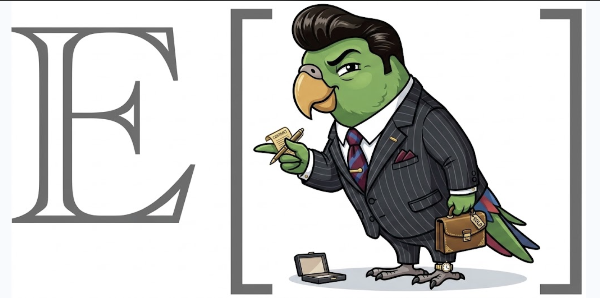

# niles



`niles` is a local-first CRM CLI for relationship work. It manages contacts,
interaction notes, follow-up tasks, teammates, materials, surveys, human intake,
and reviewed model recommendations. Every command returns a machine-readable
JSON envelope, making Niles safe for people and coding agents to operate.

This guide follows one running example: attorney Lionel Hutz is looking for new
clients around Springfield while keeping promises to his existing clients.

Docs: https://expectedparrot.github.io/niles/

License: MIT. The code and bundled Niles artwork are MIT licensed.

## For agents

Copy this block into an agent session:

```text
You are working with Niles, a local-first CRM CLI for relationship work.

Install Niles with EDSL support:
python -m pip install "niles[edsl] @ git+https://github.com/expectedparrot/niles.git"

Run commands from the directory that should contain the CRM. Your first
command—both for a new project and whenever you resume work—is:
niles agent next

Follow the JSON envelope it returns. Check `status`, read `errors` on failure,
and use the returned `next_steps` and stable identifiers. If the project has
not been initialized, the envelope will direct you to run `niles init`.

Read and mutate CRM data only through `niles` commands. Niles manages its own
storage and exchange artifacts. Use `niles sync` for commits and pushes; do
not inspect, edit, or stage Niles internal storage.

Niles makes no EP network calls and reads no EP credentials. For intake and
status requests, use Niles `export`, run the returned `publish_command`, use
Niles `register`, run the returned `pull_command`, then use Niles `import` and
`review`. For recommendations, use Niles `recommend export`, run the returned
`run_command`, then use `recommend import` and `recommend review`.

Treat imported human responses and recommendations as quarantined until an
explicit accept, merge, or reject command records the review decision. Never
store credentials in CRM state or git history.
```

## Installation

Core CRM features require Python 3.11 or newer:

```bash
python -m pip install "niles @ git+https://github.com/expectedparrot/niles.git"
niles version
```

Install the EDSL extra for humanized forms and recommendation jobs:

```bash
python -m pip install "niles[edsl] @ git+https://github.com/expectedparrot/niles.git"
python -c "import edsl; print(edsl.__version__)"
ep --help
```

The `ep` commands that publish or retrieve Expected Parrot data require
`EXPECTED_PARROT_API_KEY`. Niles itself never authenticates with Expected
Parrot or makes network calls. Never put API keys in CRM state or git history.

## Quick start: Hutz opens his CRM

```bash
mkdir hutz-law
cd hutz-law
niles init
niles agent next

niles contact add "Burns Industries" \
  --tag prospect \
  --trait source=ambulance-adjacent-referral \
  --trait priority=1 \
  --cadence-days 14

niles contact add "Waylon Smithers" \
  --company "Burns Industries" \
  --role "Executive Assistant" \
  --email smithers@burns.example \
  --tag decision-maker

niles note add burns-industries \
  "Discussed workplace liability. Smithers requested an engagement outline." \
  --kind call

niles task add burns-industries \
  "Send engagement outline before Mr. Burns loses interest" \
  --due 2026-09-05 --assign lionel --tag next-step

niles contact show burns-industries --with-notes --with-tasks
niles task list --status open --assignee lionel
niles status
```

## Base data model

Niles is event-sourced. These entities describe the current SQLite projection;
the durable records are the events that created or changed them.

### Contacts

A contact can represent a person or organization. Only `name` is required.

| Field | Meaning |
|---|---|
| `id` | Stable generated identifier with a `con_` prefix |
| `slug` | Lowercase name-based reference, such as `burns-industries` |
| `name` | Display name |
| `emails`, `phones` | Lists of contact points |
| `company`, `role` | Optional relationship context |
| `traits` | Open-ended string, number, or boolean attributes |
| `tags` | Free-form workflow labels |
| `cadence_days` | Desired maximum interval between interactions |
| `archived` | Soft-deletion state |
| `created_at` | UTC creation timestamp |
| `last_touched` | Derived from the most recent note |

`contact list --stale` returns cadence contacts whose last note is old enough,
plus cadence contacts that have never been touched.

References may be exact IDs, emails, slugs, or unique fuzzy name/company
matches. Ambiguous references fail and return candidates; mutations never guess.

### Notes

Notes are interaction records attached to contacts.

| Field | Meaning |
|---|---|
| `id` | Stable `note_` identifier |
| `contact_id` | Owning contact |
| `created_at` | Interaction timestamp |
| `kind` | `note`, `call`, `meeting`, `email`, `intake`, `debrief`, or `enrichment` |
| `text` | Note contents |
| `source` | Provenance, such as `user` |

### Tasks

| Field | Meaning |
|---|---|
| `id` | Stable `task_` identifier |
| `contact_id` | Related contact |
| `assignee` | Owner name or alias |
| `due_date` | Optional ISO date |
| `text` | Action to perform |
| `status` | `open`, `done`, `blocked`, or `cancelled` |
| `tags` | Workflow labels |
| `source` | Provenance |
| `done_note` | Completion or cancellation explanation |

### Supporting entities

- A teammate has an ID, name, aliases, optional email, and role. Tasks store
  assignee text, so aliases serve as useful conventions.
- Organization context stores one project-wide name, description, and traits.
- A material is a titled local path or URL with description and tags.
- A survey is a versioned question list plus deterministic routing rules.
- A form is a local registration for a remote intake or status-request survey.
- A submission contains quarantined answers and a review status.
- A recommendation contains a proposed task, rationale, source path, and review
  status.

Submission states are `pending`, `accepted`, `merged`, or `rejected`.
Recommendation states are `pending`, `accepted`, or `rejected`. Pulling or
importing data never mutates relationships; explicit review is the mutation gate.

## Storage and events

This is an implementation detail: normal use should go through `niles`
commands, including `niles sync`. You do not need to inspect, stage, or name
anything in this directory.

```text
.niles/
  manifest.json          project identity and storage contract
  config.toml            local format configuration
  .gitignore             excludes the derived index
  events/                append-only JSON events: source of truth
  surveys/               versioned survey definitions
  reports/               generated reports you may choose to commit
  index/niles.sqlite     disposable SQLite projection and FTS index
```

Each mutation appends a numbered JSON event with a schema version, event ID,
sequence, timestamp, type, and payload. SQLite is a cache, not an agent API.

```bash
niles rebuild-index
niles fsck
```

`fsck` validates manifests, JSON, schemas, ordering, filenames, duplicate IDs,
supported types, replay, and orphaned records. Never edit events or query the
SQLite projection directly.

Undo is compensating and append-only:

```bash
niles history --contact burns-industries
niles undo <event-id>
```

The original remains; Niles appends `event_reverted` and rebuilds without that
mutation. Undo dependent events before undoing their contact creation.

## JSON command contract

Every command writes exactly one envelope. Success exits zero:

```json
{
  "schema_version": "niles.envelope.v1",
  "status": "ok",
  "command": "contact add",
  "argv": ["contact", "add", "Burns Industries"],
  "data": {},
  "warnings": [],
  "errors": [],
  "next_steps": []
}
```

Failures exit nonzero and use stable codes in `errors[]`:

```json
{
  "status": "error",
  "data": {"candidates": []},
  "errors": [
    {"code": "unknown_contact", "message": "No contact matched 'monorail'."}
  ]
}
```

Suggested next steps declare whether they mutate state, use the network, or
require approval. Check `status` before reading `data`.

## Contacts

```bash
niles contact add "Krusty Burger" --tag prospect --cadence-days 30
niles contact add "Krusty the Clown" --company "Krusty Burger" --role Founder

niles contact show krusty-burger --with-notes --with-tasks
niles contact list
niles contact list --tag prospect
niles contact list --stale

niles contact update krusty-burger \
  --role "Potential class-action defendant" \
  --email legal@krusty.example \
  --phone 555-0113 \
  --trait lead_quality=questionable

niles contact tag krusty-burger --add active-client --remove prospect
niles contact archive krusty-burger --reason "Cease-and-desist received"
niles contact merge waylon-smithers smithers --note "Duplicate from intake"
```

Merging moves notes and tasks to the kept contact and archives the duplicate.

## Notes and enrichment

```bash
niles note add burns-industries "Initial consultation" --kind meeting
niles note add burns-industries "Demand letter sent" --kind email --at 2026-09-02
niles note list burns-industries --limit 10
niles note list --limit 25

niles enrich ingest burns-industries \
  "Burns Industries announced a nuclear safety initiative." \
  --source-url https://example.com/source --confidence 0.8
```

Research happens outside Niles; `enrich ingest` records reviewed findings.

## Tasks

```bash
niles task add burns-industries "Draft engagement letter" \
  --due 2026-09-05 --assign lionel --tag urgent

niles task list --status open
niles task list --status open --assignee lionel
niles task list --contact burns-industries
niles task list --due today

niles task update <task-id> \
  --text "Draft discounted engagement letter" \
  --due 2026-09-06 --assign selma --status blocked \
  --tag waiting-on-retainer

niles task reassign <task-id> lionel
niles task done <task-id> --note "Slid under office door"
niles task cancel <task-id> --note "Client fled jurisdiction"
niles task suggest --assignee lionel
```

`task suggest` returns suggestions for contacts with context but no open task;
it does not create tasks.

## Teammates, practice context, and materials

```bash
niles teammate add "Lionel Hutz" --alias lionel --alias hutz \
  --email lionel@hutz.example --role Attorney
niles teammate add "Selma Bouvier" --alias selma --role "Office manager"
niles teammate list
niles teammate show lionel

niles org context set \
  "Hutz Law handles personal injury, contracts, and matters of negotiable merit." \
  --name "Hutz Law" --trait jurisdiction=Springfield
niles org context show

niles material add "Standard engagement letter" \
  --path templates/engagement-letter.pdf --tag onboarding
niles material add "Fee schedule" --url https://hutz.example/fees --tag sales
niles material list
niles material list --tag onboarding
```

Materials require `--path` or `--url`.

## Search, history, status, and reports

Search uses SQLite FTS5 across contacts, notes, traits, tags, and tasks:

```bash
niles search "workplace liability"
niles search "engagement letter"
niles status
niles agent next
niles history
niles history --contact burns-industries --limit 20
niles report status --html hutz-status.html
```

The HTML report escapes CRM content before rendering.

## CSV and JSON exchange

CSV imports are previews unless `--commit` is present:

```bash
niles import csv springfield-leads.csv
niles import csv springfield-leads.csv --commit
niles export csv --output contacts.csv
niles export json --output contacts.json
niles export csv --tag prospect --output prospects.csv
```

Recognized fields are `name`, `email` or `emails`, `company`, `role`, and
`tags`. Multiple emails and tags use semicolons. TOML maps external headers:

```toml
[columns]
"Potential Plaintiff" = "name"
"Last Known Employer" = "company"
"Legal Emergency" = "tags"
```

```bash
niles import csv courthouse-steps.csv --mapping hutz-mapping.toml
niles import csv courthouse-steps.csv --mapping hutz-mapping.toml --commit
```

## Surveys and routing

`niles init` installs `debrief`, `review`, and `intake-basic` templates:

```bash
niles survey list
niles survey show debrief
niles survey copy debrief client-debrief
```

Answers are JSON keyed by question name:

```json
{
  "summary": "Smithers wants an engagement outline.",
  "sentiment": "positive",
  "next_step": "Send the outline",
  "next_by": "2026-09-05",
  "owner": "lionel"
}
```

The closed routing vocabulary is `set_field`, `set_trait`, `append_note`,
`create_task`, `task_due`, `task_assignee`, `add_tag`, `archive`, and `noop`.
Unknown actions and missing question references fail validation.

```bash
niles survey run client-debrief \
  --contact burns-industries --answers debrief-answers.json --dry-run
niles survey run client-debrief \
  --contact burns-industries --answers debrief-answers.json
niles survey export-edsl client-debrief --output client-debrief-edsl.json
```

Without `--answers`, `survey run` returns the definition and
`requires_answers: true`. EDSL export is local and makes no network request.

## Human intake

The EP boundary is strict: Niles exports and records; `ep` publishes and pulls.
First export an EDSL survey without making a network request, then let `ep`
humanize it:

```bash
niles intake export intake-basic
# Run the publish_command returned above.
niles intake register intake-basic
```

`register` records the UUID and URLs returned by EP. It does not contact EP.
Niles manages the exchange files and returns the exact EP command at each
boundary. Use the returned local form ID to connect later response imports:

```bash
# Run the pull_command returned by register.
niles intake import <local-form-id>
niles intake status
niles intake review

niles intake review <submission-id> --accept
niles intake review <submission-id> --merge burns-industries
niles intake review <submission-id> --reject --note "Prank call from Bart"
```

Imports accept EDSL Results `.ep` files or Results JSON. They are quarantined
and deduplicated. Acceptance creates a client and applies allowed routes; merge
attaches routed information to an existing client; rejection preserves the
audit record without changing relationships.

Use an explicit response path only when importing a file obtained elsewhere:
`niles intake import <local-form-id> downloaded-responses.json`.

Intake surveys cannot archive contacts or set protected fields. Close currently
closes the local registration; the remote API lacks non-destructive close, so
the envelope reports `remote_closed: false` (Coopr issue #3950).

## Client status requests

```bash
niles status-request export client-debrief
# Run the returned publish_command.
niles status-request register client-debrief \
  --contact burns-industries --recipient smithers@burns.example
# Run the returned pull_command.
niles status-request import <local-form-id>
niles status-request status
niles status-request review
niles status-request review <submission-id> --accept
niles status-request review <submission-id> --reject --note "Unverified update"
```

Accepted answers use deterministic survey routing. Rejected answers remain in
history and cause no CRM mutation. As with intake, Niles performs no publishing,
pulling, authentication, or other network activity.

## Recommendation jobs

Niles prepares EDSL jobs but never runs models itself:

```bash
niles recommend export next-steps --tag prospect
# Run the returned run_command.
niles recommend import --name next-steps
niles recommend review
niles recommend accept <recommendation-id> --assign lionel --due 2026-09-10
niles recommend reject <recommendation-id>
```

Import is quarantined. Acceptance creates one `recommendation`-tagged task and
preserves the source results path and review provenance.

## Moving and syncing a CRM

Git provides sync and provenance, but Niles owns the durable-state path list.
Initialize the project as a git repository once, then use `niles sync`:

```bash
git init
git remote add origin git@github.com:example/hutz-law-crm.git
niles sync --dry-run
niles sync --message "Update Hutz Law CRM"
```

`niles sync` stages only durable CRM state. It never stages the rebuildable
index, managed EP exchange files, or unrelated working-tree files. It commits
the durable paths and runs `git push`.

To create a local commit without pushing:

```bash
niles sync --no-push --message "Checkpoint Hutz Law CRM"
```

If there are no new durable changes, no commit is created. Push failures are
reported as structured errors and include the locally created commit ID.

Portable ZIP archives contain durable state and exclude SQLite:

```bash
niles export hutz-law.zip
mkdir hutz-law-restored
cd hutz-law-restored
niles import /path/to/hutz-law.zip
niles fsck
```

Import refuses to overwrite existing state unless explicitly requested:

```bash
niles import /path/to/hutz-law.zip --replace
```

## Agent operating rules

1. Run commands from the CRM project, not the Niles source checkout.
2. Start or resume with `niles agent next`.
3. Check envelope `status` and `errors[]`.
4. Reuse exact IDs, emails, or slugs from prior commands.
5. Mutate only through the CLI; never edit events or SQLite.
6. Preview CSV imports and survey routes before committing.
7. Treat pulled human responses and recommendations as quarantined.
8. Never accept or merge quarantined data without a review decision.
9. Never store credentials in CRM state.
10. Use `niles sync` when provenance or remote sync is wanted; never stage or
    manage Niles internal storage yourself.

If a view is missing, that is a Niles feature gap—not a reason to bypass the
command layer.

## Source development

```bash
make test
make coverage
```

Coverage follows subprocesses, measures branches, and enforces an 85% floor.
Read `SPEC.md` before changing command semantics, event shapes, survey routing,
the envelope, or EDSL handoffs.
